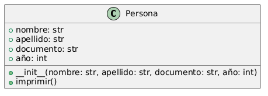
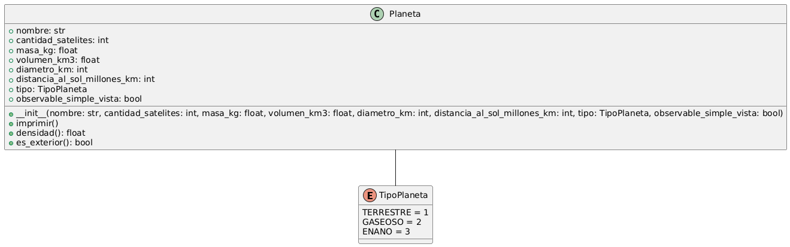
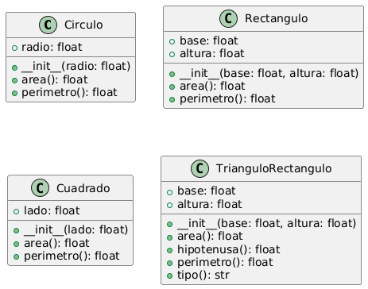
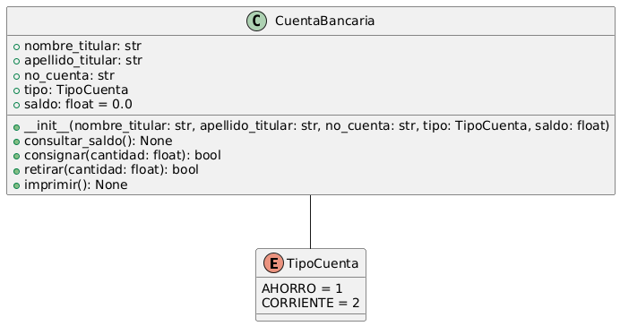

# 📘 Tarea 2 de Programación Orientada a Objetos

El archivo adjunto contiene los 5 ejercicios que se debían realizar.

---

## 🧠 Contenido

- [`tarea2.ipynb`](./main.py): Archivo principal que contiene los ejercicios.

---

## 🚀 Único integrante
Alejandro Valencia Ossa

---

##  📷 Diagramas de clase

## Clase Pesona

---
## Clase Planeta

---
## Clase Automómovil

---
## Clases de las figuras

---
## Clase CuentaBancaria

